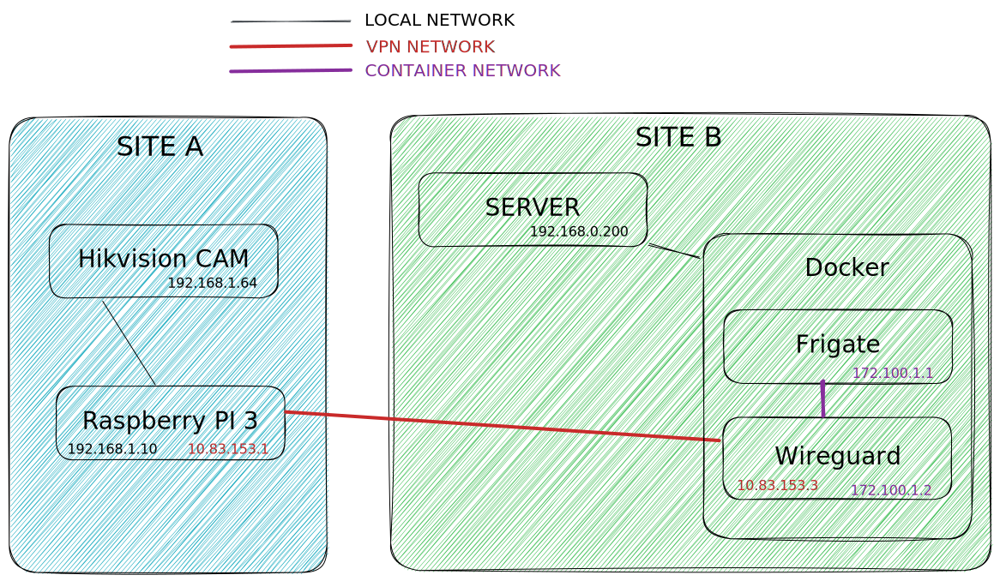

# Wireguard Frigate and NAT

## Project

### Preamble

My goal was to be able to stream a remote outdoor camera in real time and
to have a network video recording system (NVR)

I asked myself this question and then through discussions with my colleagues
and people on reddit, I finally found the tools I'm going to need to achieve
this goal.

### How to do ?

Let's start by defining the two sites:

| Site A (Distant) |     Site B (My Home)    |
|:----------------:|:-----------------------:|
| Hikvision Camera | Open Media Vault Server |
| Raspberry PI 3   | Docker                  |

So, now we have defined the 2 sites, let's talk about how we will connect
everything to get something working

**NVR :** I've found on GitHub a very interesting Open Source project dedicated
for Network Video Recording. It's called
[Frigate](https://github.com/blakeblackshear/frigate)

**VPN :** To create a simple VPN between two hosts, Wireguard came by default :)

### Schematic representation

[{: style="width:1000px"}](Schema.svg)

## Let's build it

### Site A

We need to install and configure WireGuard on the Raspberry PI.
To do that, I've simply used [PiVPN](https://pivpn.io/)

Just follow the doc, it will work like a charm

Here are my server config file :

```title="/etc/wireguard/wg0.conf"
[Interface]
Address = 10.83.153.1/24
MTU = 1480
SaveConfig = true
ListenPort = 51820
PrivateKey = XXX

# To forward all wireguard traffic to eth0 and translate it
PostUp = iptables -A FORWARD -i %i -j ACCEPT; \
iptables -A FORWARD -o %i -j ACCEPT; \
iptables -t nat -A POSTROUTING -o eth0 -j MASQUERADE
PostDown = iptables -D FORWARD -i %i -j ACCEPT; \
iptables -D FORWARD -o %i -j ACCEPT; \
iptables -t nat -D POSTROUTING -o eth0 -j MASQUERADE

# My Distant Server
[Peer]
PublicKey = XXX
AllowedIPs = 192.168.1.201/32, 10.83.153.3/32
PersistentKeepalive = 25
```

!!! warning

    Before updating your wireguard configuration ensure that server is stopped
    `wg-quick down wg0`

### Site B

We need to deploy a docker-compose stack with private container network inside
it.

```yaml title="docker-compose.yml"
version: "3"
services:
    wireguard:
        image: linuxserver/wireguard
        container_name: wireguard
        cap_add:
            - NET_ADMIN
            - SYS_MODULE
        sysctls:
            - net.ipv4.conf.all.src_valid_mark=1
        environment:
            - PUID=1000
            - PGID=1000
            - TZ=Europe/Paris
        volumes:
            - /path/to/wireguard/config:/config
        restart: unless-stopped
        networks:
            - vpn

    frigate:
        container_name: frigate
        restart: unless-stopped
        image: blakeblackshear/frigate:stable
        shm_size: "64mb"
        volumes:
            - /etc/localtime:/etc/localtime:ro
            - /path/to/frigate/config.yml:/config/config.yml:ro
            - /path/to/frigate/storage:/media/frigate
        ports:
            - "5000:5000"
            - "1935:1935"
        environment:
        FRIGATE_RTSP_PASSWORD: # GENERATE A RANDOM PASSWORD USING BITWARDEN :)
        networks:
            - vpn

networks:
    vpn:
        name: vpn
        driver: bridge
```

#### Wireguard config

We need to configure the tunnel in order to allow frigate when communicating to
wireguard to directly forward to camera.

Here is my wireguard config file :

``` title="wg0.conf"
[Interface]
PrivateKey = XXX
Address = 10.83.153.3/24
MTU = 1480

PostUp = iptables -t nat -A PREROUTING -p tcp --dport 554 -j DNAT \
--to-destination 192.168.1.201:554
PostUp = iptables -t nat -A POSTROUTING -j MASQUERADE

PostDown = iptables -t nat -D PREROUTING -p tcp --dport 554 -j DNAT \
--to-destination 192.168.1.201:554
PostDown = iptables -t nat -D POSTROUTING -j MASQUERADE

[Peer]
PublicKey = XXX
Endpoint = IP:PORT or DNS:PORT
AllowedIPs = 192.168.1.201/32, 10.83.153.1/32
PersistentKeepalive = 25
```

#### Frigate config

We need to configure Frigate in order to communicate with the camera on RTSP

Here is my frigate config file :

```yaml title="config.yml"
mqtt:
  host: <mqtt host, Home Assistant for me>
  user: <user>
  password: <password>

cameras:
  <name of your camera>:
    ffmpeg:
      inputs:
        # Thanks to docker, we can use the DNS name instead of IP
        - path: rtsp://<user>:<password>@wireguard/video/main
          roles:
            - detect
            - rtmp
    rtmp:
      enabled: False
    detect:
      width: 1280
      height: 720
```

## Deploy it

To deploy the stack you have just to execute the following command inside the
folder where docker-compose.yml is stored `docker compose up -d`

Once deployed, just go to [http://serverip:5000](http://serverip:5000)

If all is ok, you will see your camera !

Voilà !
