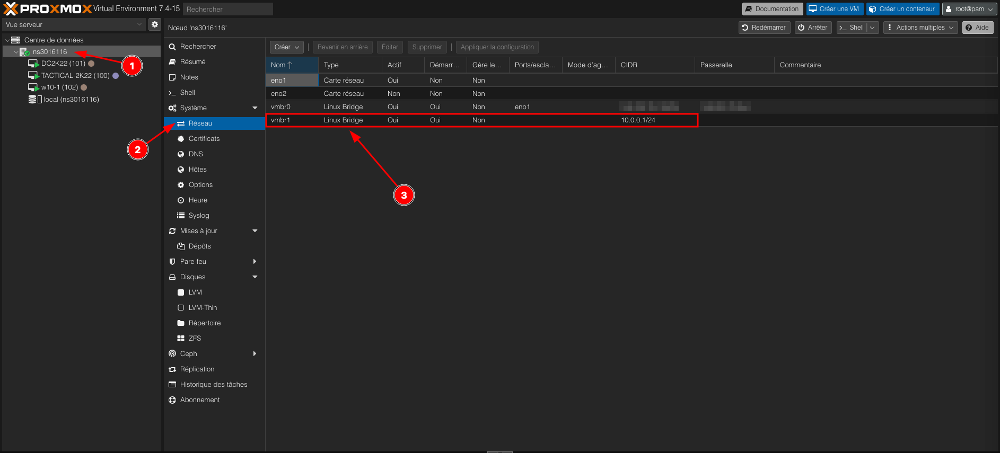

# Network configuration

## How to have network and let be accessible from internet without additionnal ip

**On your Proxmox instance bash :**

Update the file `/etc/network/interfaces` and add this at the end of the file

```text
auto vmbr1
iface vmbr1 inet static
  address 10.0.0.1/24
  netmask 255.255.255.0
  bridge-ports none
  bridge-stp off
  bridge-fd 0
  post-up echo 1 > /proc/sys/net/ipv4/ip_forward
  post-up iptables -t nat -A POSTROUTING -s '10.0.0.0/24' -o vmbr0 -j MASQUERADE
  post-down iptables -t nat -D POSTROUTING -s '10.0.0.0/24' -o vmbr0 -j MASQUERADE
```

Restart services : `service networking restart`

You should have something like that :
<figure markdown>
[{: style="width:400px"}](../screenshots/new_network_added.png)
</figure>

With this configuration, when you create a VM simply choose `vmbr1` network.

## NAT port forwarding

To add port forwarding you can simply update the `/etc/network/interfaces` file
and add this line in `iface vmbr1 inet static` update the line according to
your need

```text
post-up iptables -t nat -A PREROUTING -i vmbr0 -p tcp --dport 3389 -j DNAT --to 10.0.0.2:3389
post-down iptables -t nat -D PREROUTING -i vmbr0 -p tcp --dport 3389 -j DNAT --to 10.0.0.2:3389

## Add DHCP and DNS server to your Proxmox Virtual Environment

To do that, we will use dnsmasq which is a simple and lightweight app

```bash
apt install dnsmasq -y
```

Edit the configuration file

```bash
vim /etc/dnsmasq.conf
```

Fill these values :

```text
server=1.1.1.1 #DNS Server IP
interface=vmbr1 #Interface where dnsmasq will works
domain=stephang.local #Optional
dhcp-range=10.0.0.10,10.0.0.150,1h #It's an example
dhcp-option=vmbr1,3,10.0.0.1
dhcp-leasefile=/var/lib/misc/dnsmasq.leases #Uncomment it line 538
# If you want to reserve IP for specific mac :
dhcp-host=E6:13:98:65:CA:9F,10.0.0.2,SERVER1
dhcp-host=G2:84:14:27:FE:4G,10.0.0.3,SERVER2
```

Restart the service :

```bash
service dnsmasq restart
```

That's all !
Now when you create a VM and set **vmbr1** network, VM will have
network and auto generated IP !

## Bonus : add DNS record accessible by all clients

Sometimes when you want to add local dns records and with **dnsmasq** it's
really easy, you need to simply update your hosts file

```bash
vim /etc/hosts

10.0.0.2 server1.stephang.local
```

Now all ips in **vmbr1** will have the dns record
