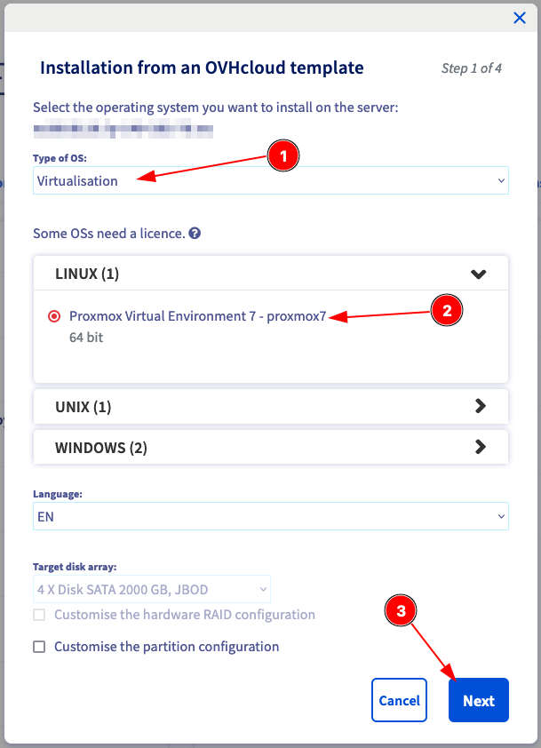

# Installation on OVHcloud provider

* Order a dedicated server on
[OVHcloud website](https://www.ovhcloud.com/fr/bare-metal/).
It can be also an eco one

* Install Proxmox using the OVHcloud manager
or the [API](https://api.ovh.com/console/#/dedicated/server)

[{: style="width:400px"}](1.png)

[{: style="width:400px"}](2.png)

[{: style="width:400px"}](3.png)

???+ warning classes
    Don't forget to select your SSHKey !

[{: style="width:400px"}](4.png)

* Click on confirm

Wait around 10 minutes to installation complete
You will receive an email when it's done

???+ success classes
    **Your proxmox server is now installed !**
