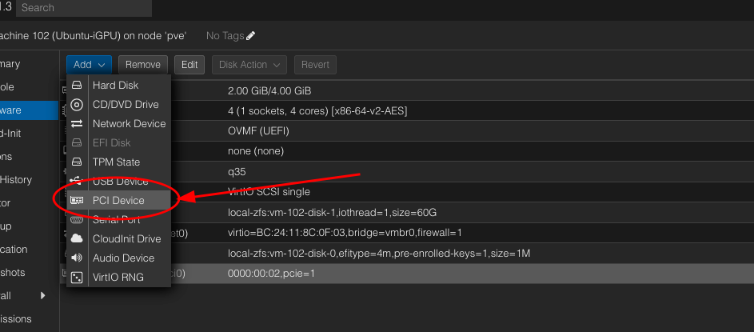
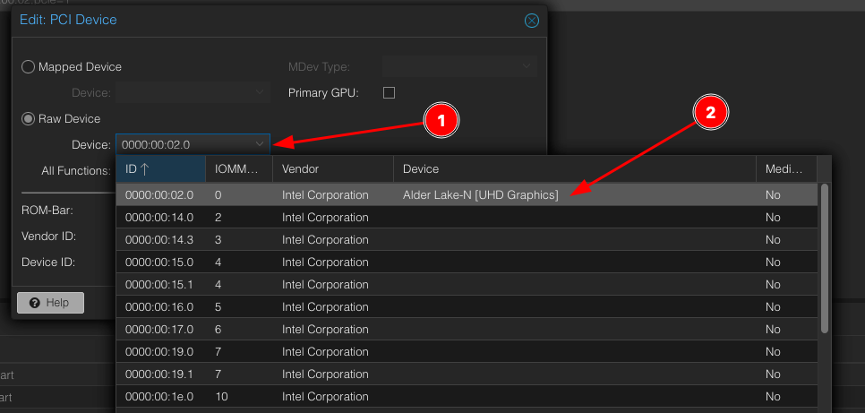
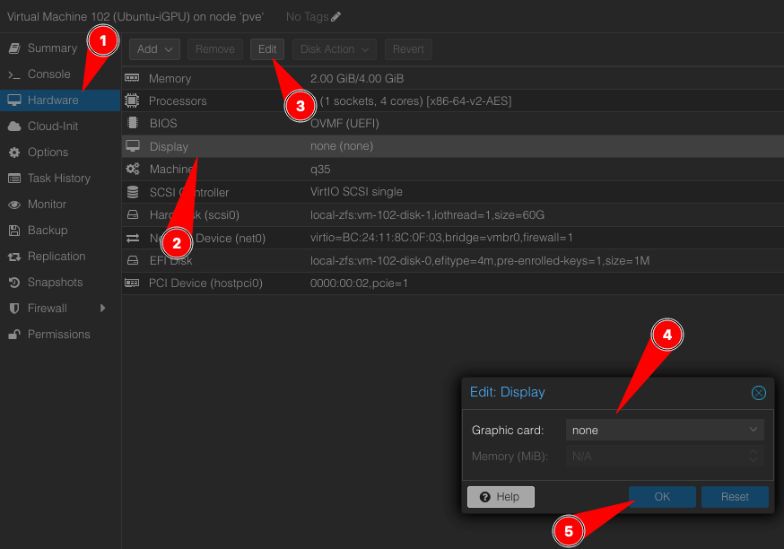

Tutorial inspired by this [one](https://3os.org/infrastructure/proxmox/gpu-passthrough/igpu-passthrough-to-vm/)
### Enable VGA card UEFI with ZFS

1. Connect to Proxmox with SSH or via SHELL

2. Edit the kernel cmdline file
```shell
vim /etc/kernel/cmdline
```
Append `quiet intel_iommu=on iommu=pt` to the line, you should obtain something like this :
```shell
root@pve:~# cat /etc/kernel/cmdline
root=ZFS=rpool/ROOT/pve-1 boot=zfs quiet intel_iommu=on iommu=pt
```

3. Update the modules file
```shell
vim /etc/modules
```
Add this to the file :
```shell
vfio
vfio_iommu_ype1
vfio_pci
vfio_virqf
```
You should obtain something like this :
```shell
root@pve:~# cat /etc/modules
# /etc/modules: kernel modules to load at boot time.
#
# This file contains the names of kernel modules that should be loaded
# at boot time, one per line. Lines beginning with "#" are ignored.
# Parameters can be specified after the module name.

vfio
vfio_iommu_ype1
vfio_pci
vfio_virqfd
```

4. Refresh the efi boot file `pve-efiboot-tool refresh`
```shell
root@pve:~# pve-efiboot-tool refresh
Running hook script 'proxmox-auto-removal'..
Running hook script 'zz-proxmox-boot'..
Re-executing '/etc/kernel/postinst.d/zz-proxmox-boot' in new private mount namespace..
Copying and configuring kernels on /dev/disk/by-uuid/5EBA-2B61
	Copying kernel and creating boot-entry for 6.2.16-19-pve
	Copying kernel and creating boot-entry for 6.5.11-4-pve
	Removing old version 6.2.16-3-pve
Copying and configuring kernels on /dev/disk/by-uuid/5EBA-9A63
	Copying kernel and creating boot-entry for 6.2.16-19-pve
	Copying kernel and creating boot-entry for 6.5.11-4-pve
	Removing old version 6.2.16-3-pve
```

5. Reboot the system
```
root@pve:~# reboot
```

6. Verify that IOMMU is enabled `dmesg | grep -e DMAR -e IOMMU`
```shell hl_lines="4"
root@pve:~# dmesg | grep -e DMAR -e IOMMU
[    0.017850] ACPI: DMAR 0x0000000075516000 000088 (v02 INTEL  EDK2     00000002      01000013)
[    0.017883] ACPI: Reserving DMAR table memory at [mem 0x75516000-0x75516087]
[    0.047825] DMAR: IOMMU enabled
[    0.106238] DMAR: Host address width 39
```

### Configure the iGPU to Ubuntu guest VM
1. Create a Ubuntu VM (I've a 22.04.3 LTS one)
!!! warning
    It needs to have at least:

    - BIOS: **OMVF (UEFI)**
    - Machine: **q35**

2. Pass the iGPU from proxmox to the VM
    <figure markdown>
    [{: style="width:400px"}](../screenshots/igpu_1.png)
    *Add new PCI Device*
    </figure>

3. Choose the one with `Alder Lake-N [UHD Graphics]`
    <figure markdown>
    [{: style="width:400px"}](../screenshots/igpu_2.png)
    *Choose the iGPU device*
    </figure>

4. Enable some functions
    <figure markdown>
    [{: style="width:400px"}](../screenshots/igpu_3.png)
    </figure>

5. Disable the display of the VM
    <figure markdown>
    [{: style="width:400px"}](../screenshots/igpu_4.png)
    </figure>

6. Reboot the VM
7. Connect to it through SSH
8. Install `linux-image-generic-hwe-22.04`
```shell
root@ubuntu-docker:/# apt update
root@ubuntu-docker:/# apt install linux-image-generic-hwe-22.04
```
9. Reboot
```shell
root@ubuntu-docker:/# reboot
```
10. Check that `renderD128` is present
```shell
root@ubuntu-docker:~# ls /dev/dri
by-path  card0  renderD128
```

You're good to go !
