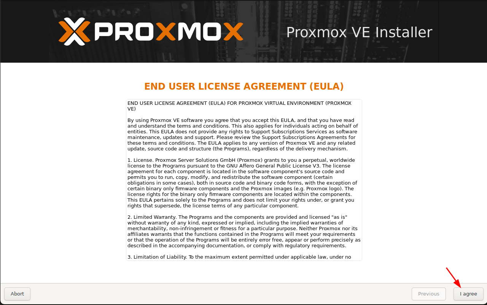
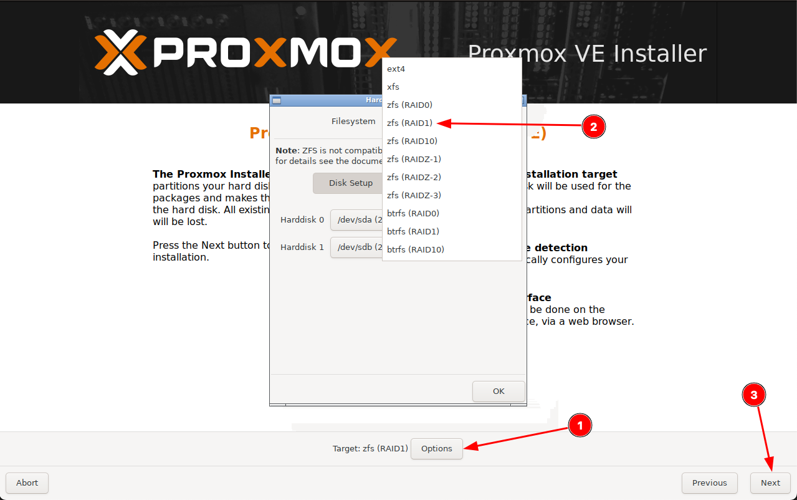
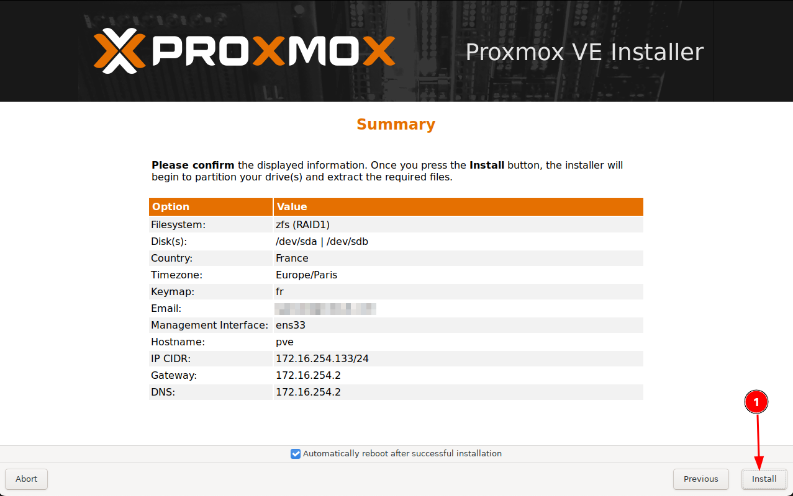
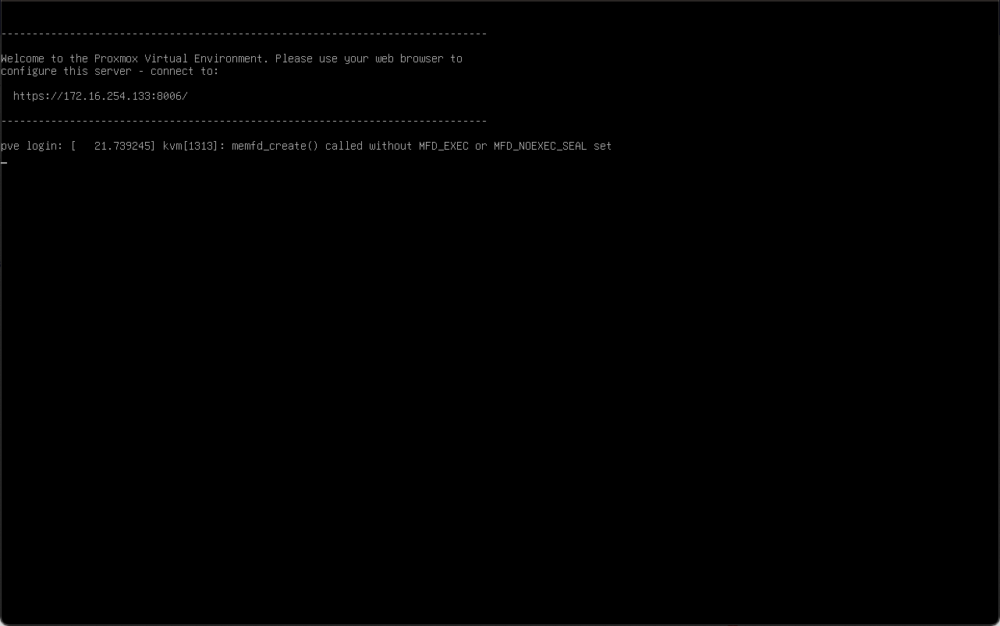

# Installation

Simply follow these steps :

## Step 1
<figure markdown>
[{: style="width:400px"}](../screenshots/install_1.png)
*Click on first link*
</figure>

## Step 2
<figure markdown>
[{: style="width:400px"}](../screenshots/install_2.png)
*Accept the End User License Agreement (EULA)*
</figure>

## Step 3
<figure markdown>
[{: style="width:400px"}](../screenshots/install_3.png)
*Click on option, choose zfs (RAID1) and click on next*
</figure>

## Step 4
<figure markdown>
[{: style="width:400px"}](../screenshots/install_4.png)
*Configure your location and time zone*
</figure>

## Step 5
<figure markdown>
[{: style="width:400px"}](../screenshots/install_5.png)
*Set password and valid email*
</figure>

## Step 6
<figure markdown>
[{: style="width:400px"}](../screenshots/install_6.png)
*Update the network config according your needs*
</figure>

## Step 7
<figure markdown>
[{: style="width:400px"}](../screenshots/install_7.png)
*Install Proxmox*
</figure>

## Step 8
<figure markdown>
[{: style="width:400px"}](../screenshots/install_8.png)
*Proxmox is well installed*
</figure>
